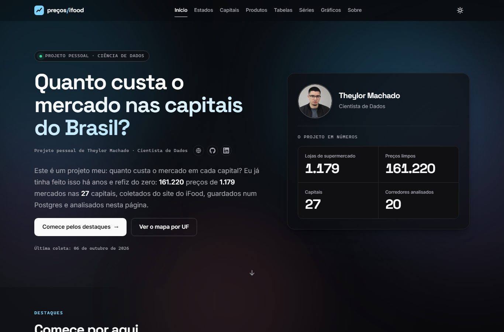

[Português](README.md) · **English**

# Supermarket prices on iFood, in Brazil's state capitals

A personal data science project by [Theylor Machado](https://theylor.vercel.app). It compares supermarket prices published on the iFood website in the 27 Brazilian state capitals. The latest collection, on October 6, 2026, has 161,220 prices from 1,179 stores, in 20 aisles. This repository has only the static site, which reads the exported JSON files in `data/`.



## Pages

| Page | What it has |
|---|---|
| `index.html` (Home) | The project's question, the overall numbers and five highlights in plain language |
| `estados.html` | Map of prices by state (UF) for the same items, and the iFood basket against the DIEESE basket, state by state |
| `capitais.html` | One capital at a time: population, stores, price of a pack of rice, milk and coffee |
| `produtos.html` | Everyday items, aisles, most common products and price variation between stores |
| `tabelas.html` | All tables, with search and sorting |
| `series.html` | The DIEESE Basic Food Basket by capital and the IPCA over time |
| `graficos.html` | Gallery of the charts from the analysis notebook |
| `sobre.html` | Methodology, caveats, sources and author |

More screenshots: [states](docs/screenshots/estados-dark.png), [tables](docs/screenshots/tabelas-dark.png), [light theme](docs/screenshots/home-light.png) and [mobile](docs/screenshots/home-mobile-375.png).

## Highlights

All comparisons use the same items in each place.

- **States:** buying the same products, Mato Grosso comes out 10% more expensive than the national median and Sergipe 7% cheaper.
- **Chains:** for milk, Atacadão is 14.4% below the median of its own state (12 stores compared).
- **Basic basket:** built with the cheapest iFood product, the basket comes out a median 6% below the DIEESE survey; in 6 of the 21 states compared it comes out above.
- **Everyday items:** the 1 L Piracanjuba whole milk usually costs between R$ 6.03 and R$ 11.10, with a median of R$ 7.98, in 109 stores.

These numbers come from the JSON files in `data/` and change when the data changes.

## How to run

The site is static and has no build step. It uses `fetch` to read the JSON files, so it needs an HTTP server; opening the file directly (`file://`) does not work.

```bash
python -m http.server 8321    # or: npx serve .
```

Open `http://localhost:8321` in the browser.

## Languages

The site comes in Brazilian Portuguese (pt-BR) and English. The **PT · EN** button in the header switches the language; the page reloads in the chosen language, at the same scroll position.

- **Which language opens.** The first one that exists wins: `?lang=pt` or `?lang=en` in the URL (the choice is also saved), the choice saved in `localStorage` (`ifood-precos:lang`), or the browser language (starts with `pt` → Portuguese; anything else → English). The `<html lang>` tag becomes `pt-BR` or `en`.
- **Formats.** Number, date and percentage follow the language. The currency is always the real: `R$ 7,98` in Portuguese and `R$7.98` in English.
- **Where the texts are.** All texts are in `js/i18n.js`, in the `pt` and `en` objects, with the same keys (`page.section.name`).
- **Fixed HTML text.** `data-i18n="key"` replaces the element's text; `data-i18n-html="key"` replaces the inner HTML (links, `<strong>`); `data-i18n-attr="aria-label:key,placeholder:other"` replaces attributes. The Portuguese text stays in the HTML as a fallback. `<title>` and the meta description use `<page>.title` and `<page>.meta`.
- **Text built in `js/sec-*.js`.** Use `IP.t('key', { name: value })`, which replaces `{name}` in the text. With `count`, it picks `key.one` (1) or `key.other` and shows the number in `{count}`. `IP.tn` accepts DOM nodes in the variables. A missing key shows in the console as `[i18n] missing key` and on screen as `⟦key⟧`.
- **Data is not translated.** Product, aisle, chain, DIEESE item, state and city names stay as they come from the JSON files. The exceptions are the cleaning rule (`_meta.json`, `limpeza.regra`) and two warning formats in `avisos`, which have an English translation when the text is the known one; any other text shows as it came in the file. If the rule changes in the pipeline, update the `meta.limpeza.regra` key.
- **Images.** The charts in `img/` come out of the notebook with Portuguese text and are not translated.
- **How to add a text.** Create the key in both objects of `js/i18n.js`, use it in the HTML or in `IP.t`, and open the page in both languages.

## Where the data comes from

A separate pipeline, which is not in this repository, collects the prices (Python, PostgreSQL and Jupyter). It reads public prices from the iFood website, without logging in, at about 1 request per second. It then removes extreme prices with the MAD (median absolute deviation) rule and exports the files below. This site only reads the result.

| File in `data/` | What it has |
|---|---|
| `_meta.json` | Export date, list of files, warnings and a summary of the price cleaning |
| `kpis.json` | Project totals: stores, prices, date of the last collection |
| `por_uf.json` | Stores, collected prices, raw average price, population and GDP per capita by state |
| `indice_uf.json` | Price of the same items in each state against the national median (100 = median) |
| `capitais.json` | One row per capital: population, stores, baskets and prices of a pack of rice, milk and coffee |
| `cesta_estado.json` | iFood basket against the DIEESE basket by state, item by item |
| `corredores.json` | Number of products, average price and standard deviation by aisle |
| `produtos_mais_comuns.json` | The 50 products present in the most stores, with average, minimum and maximum price |
| `cotidiano.json` | Everyday branded items, with median and typical range (10th and 90th percentiles) |
| `dispersao_por_produto.json` | Variation of the price of the same product between stores |
| `redes.json` | Price of each chain against the state median, on the same items |
| `series_dieese.json` | Monthly cost of the DIEESE Basic Food Basket by capital |
| `series_ipca.json` | Monthly IPCA for Brazil (general index and food at home) |

Money values in these files are in cents.

## Methodology and caveats

- **Same items.** States, chains and capitals are compared only on identical or similar products. The raw average depends on what each place sells and appears only as a reference.
- **Items matched to DIEESE.** Each item of the DIEESE basket is linked to an iFood product by name, using the cheapest one per kilo or liter. It is an order of magnitude, not an official index, and states with few matched items are left out.
- **Items sold by weight.** A product sold by weight shows the price of a minimum quantity, not of 1 kg. The per-kilo or per-liter prices used in the comparisons are converted in the pipeline.
- **A snapshot, capitals only.** Each collection is a one-day snapshot, only of the capitals and only of what iFood lists and delivers at the chosen points. App prices may include a margin and promotions and differ from the shelf price.
- **Chains.** The API hardly reports the chain, so it is inferred from the store name.

More details on the `sobre.html` page.

## Folder structure

```
index.html ... sobre.html   the eight pages
css/        styles
js/         scripts for each page (plain JS, no modules); i18n.js has the pt and en texts
vendor/     Chart.js 4.5.1 (local)
fonts/      Space Grotesk and Inter (local)
geo/        simplified state boundaries for the map
data/       JSON exported by the pipeline
img/        author photo and charts from the notebook
docs/       screenshots
```

## Technologies

Plain HTML, CSS and JavaScript, no build. Charts use Chart.js 4.5.1 and the map is SVG. Fonts, libraries and map are local files: the site makes no requests to external servers.

## Sources and third-party licenses

- [IBGE SIDRA](https://sidra.ibge.gov.br/): population (2022 Census), IPCA, municipal GDP and income.
- [DIEESE](https://www.dieese.org.br/cesta/): National Survey of the Basic Food Basket.
- [kelvins/municipios-brasileiros](https://github.com/kelvins/municipios-brasileiros): IBGE code, name, state and coordinates of the municipalities.
- State boundaries: IBGE, simplified for the map.
- [Chart.js](https://www.chartjs.org/) 4.5.1, MIT license (`vendor/chart.js.LICENSE.md`).
- [Space Grotesk](https://github.com/floriankarsten/space-grotesk) and [Inter](https://github.com/rsms/inter), SIL OFL 1.1 license (`fonts/*.LICENSE.txt`).

## Author

**Theylor Machado**, Data Scientist | Demand Forecasting and Time Series.

- Portfolio: [theylor.vercel.app](https://theylor.vercel.app)
- GitHub: [theylor999](https://github.com/theylor999)
- LinkedIn: [theylor921](https://www.linkedin.com/in/theylor921)

## Notice

Personal, non-commercial project. It has no affiliation with iFood.
